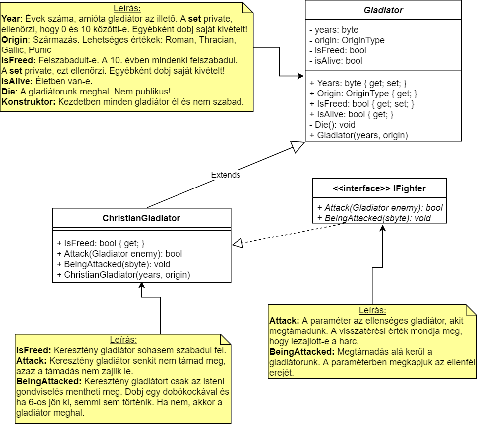
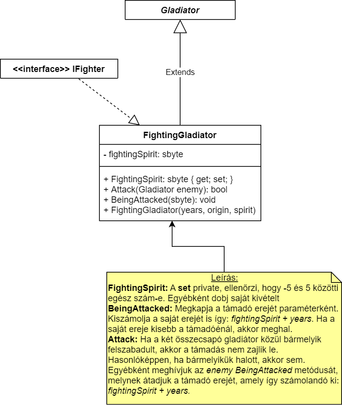

# Gladiátorok az arénában

A gladiátorok az ókori római arénákban egymás ellen küzdő harcosok voltak. 
A hagyomány szerint eredetileg a hódító hadjáratok során foglyul ejtett rabszolgák voltak, ám Néró császár idejében a keresztényeket is a gladiátorok közé "dobták". 
Na de egy hithű keresztény vajon milyen eséllyel indult az életre-halálra szóló küzdelemben?

Töltsd le a félkész programot és fejleszd tovább az alábbi feladatoknak megfelelően!

## 1. feladat

Az alábbi UML ábra alapján egészítsd ki a *Gladiator* és a *ChristianGladiator* osztályokat, illetve írd meg az interfészt!

Az interfész alatt a metódusok és paramétereik értelmezését írjuk csak le azért, hogy az interfészt implementáló osztályban könnyebben érthetőek legyenek a tennivalók.

## 2. feladat

Az alábbi UML ábra alapján egészítsd ki a *FightingGladiator* osztályt!

A harci gladiátorok ereje a harci kedvüktől (*FightingSpirit*) és a tapasztságuktól (*Years*) függ.

## 3. feladat

Egészítsd ki a főprogramot!

Kezeld a lehetséges keletkező kivételeket!

15x támadj random gladiátorral egy másik random gladiátort (önmagát ne támadja!). Minden esetben írasd ki, hogy lezajlott-e támadás!

Végül írasd ki, hogy hány harci gladiátor és hány keresztény gladiátor maradt életben!

*A feladat szerzője Kovásznai Gergely.*
